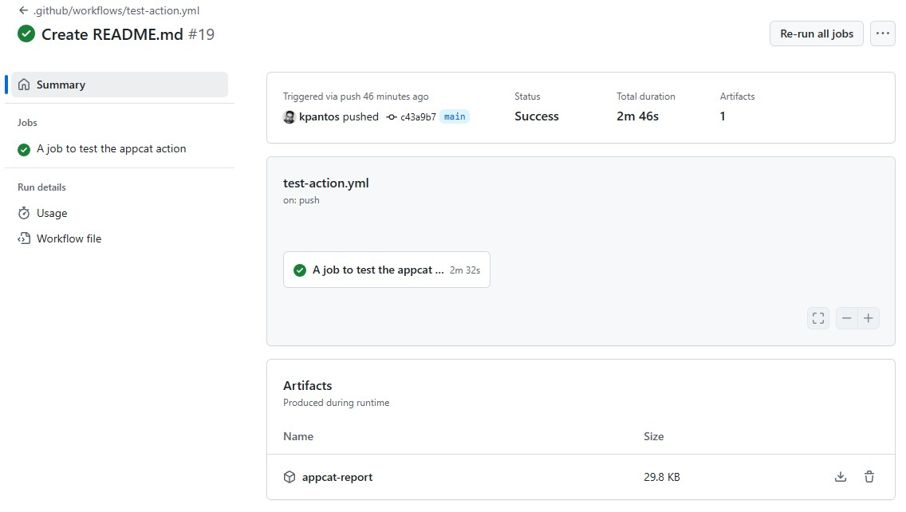

# Assess .NET application using AppCAT tool

[](https://github.com/kpantos/dotnet-appcat-action/actions/workflows/test-action.yml)

This action uses the [Azure Migrate application and code assessment for .NET](https://learn.microsoft.com/en-us/azure/migrate/appcat/dotnet) CLI tool to assess .Net applications and upload the assesment report into your repository.

GitHub has data that is not represented in git — like Issues and PRs. The purpose of this action is to capture that data in a portable, usable fashion.

### Prerequisites
- The action requires a Windows based runner. Find out more on [Standard GitHub-hosted runners](https://docs.github.com/en/actions/using-github-hosted-runners/using-github-hosted-runners/about-github-hosted-runners#standard-github-hosted-runners-for-public-repositories)

## Setup

Create an action! Copy the following into the action created:

```yaml

jobs:
  assess:
    runs-on: windows-latest
    name: A job to to run an appcat action
    steps:
      - uses: actions/checkout@v5
      - id: foo
        uses: kpantos/dotnet-appcat-action@v5
        with:
          source: '<SOURCE>'
          path: '<PATH>'
          target: '<TARGET>'
          privacyMode: '<PRIVACY_MODE>'
          serializer: '<SERIALIZER>'
```

This workflow definition can be triggered for all of the [webhook event types that GitHub supports](https://docs.github.com/en/actions/reference/events-that-trigger-workflows#webhook-events).

### Parameters

| Name | Required? | Description |
|--|--|--|
| source | **true** | Source which the tool should analyze (Solution or Folder) |
| path | **true** | Specify either the application (.sln) or the folder path to be analyzed |
| target | **true** | Target toward which the tool should analyze the application |
| privacyMode | false | Privacy mode specifying how much data is included in generated report files (Unrestricted, Protected, Restricted). Default is Unrestricted. |
| serializer | false | Specifies the format for the report to be used after analysis is complete (HTML, CSV, JSON, etc). Default is HTML. |


## Output

The assesment report is returned as an artifact of the executed workflow and can be downloaded localy to review 



# License
